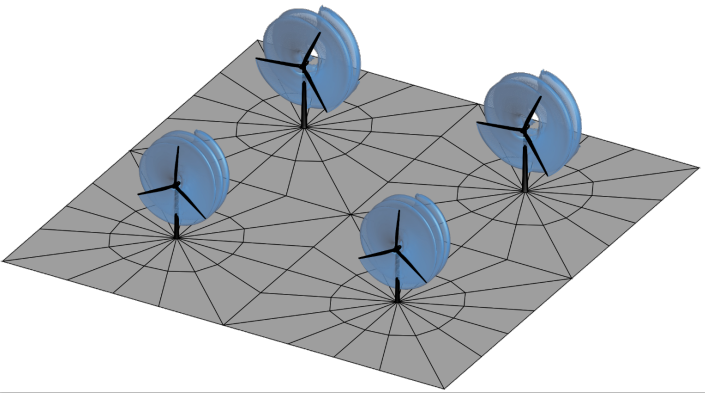

# Repository for the UVLM-oriented mesh generator UVLMeshGen

This software can be used and distributed under the following license:

Shield: [![CC BY 4.0][cc-by-shield]][cc-by]

This work is licensed under a
[Creative Commons Attribution 4.0 International License][cc-by].

[![CC BY 4.0][cc-by-image]][cc-by]

[cc-by]: http://creativecommons.org/licenses/by/4.0/
[cc-by-image]: https://i.creativecommons.org/l/by/4.0/88x31.png
[cc-by-shield]: https://img.shields.io/badge/License-CC%20BY%204.0-lightgrey.svg

----------------------------------------------------------------------------------------------------
**UVLMeshGen:**  
First version released on June 22, 2023.

**Warning:**  
It works on Matlab 7+  
A technical description of the implementation can be found in the following paper:

Roccia, B.A., Ceballos, L.R., Verstraete, M.L., and Gebhardt, C.G., "UVLM-based mesh generator intended for onshore and offshore wind farms," _Wind Energy Science_, submitted June 20, 2023. 

**Use of external functions:**  
UVLMeshGen relies on the function **cprintf** developed by **Yair Altman** for warnings and error messages. 

Yair Altman (2023). cprintf - display formatted colored text in Command Window (https://www.mathworks.com/matlabcentral/fileexchange/24093-cprintf-display-formatted-colored-text-in-command-window), MATLAB Central File Exchange. Retrieved June 22, 2023.

**Bugs and suggestions:**
Please send to the contact list provided below.

----------------------------------------------------------------------------------------------------

**Capabilities:**  
1) Wind turbine meshing (blades, hub, nacelle, tower, monopile, terrain),  
2) Wind farm meshing (multiple wind turbines), heterogeneous wind farms are possible,  
3) Terrain topography allowed,  
4) Kinematics module, which allows to generate the wind farm kinematics,  
5) Outputs (by default the user can choose exporting the mesh in Tecplot format), or include a user-defined script for exporting purposes.

**Limitations:**  
1) Does not support meshing of substructures (only monopile type structures),  
2) Substructure kinematics not included,  
3) Sea level surface kinematics not included.

**Collaborative work developed by:**  
Bergen Offshore Wind Centre (BOW), University of Bergen, Norway  
Group of Applied Mathematics, National university of Río Cuarto, Argentina  

**Contact:**  
Dr. Bruno Roccia (bruno.roccia@uib.no), University of Bergen, Norway  
Dr. Luis Ceballos (lceballos@ing.unrc.edu.ar), National University of Río Cuarto, Argentina

